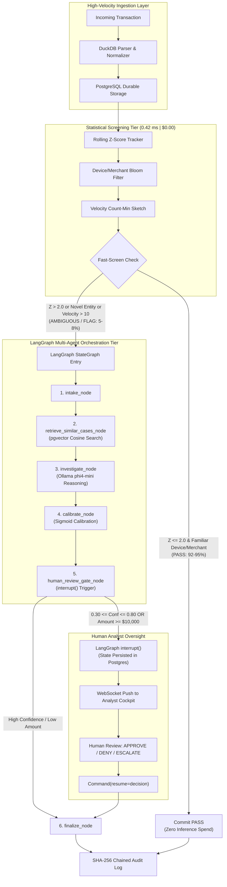

# FinSentinel AI — Enterprise Financial Crime & Ledger Surveillance Platform

<div align="center">

```
  ███████╗██╗███╗   ██╗███████╗███████╗███╗   ██╗████████╗██╗███╗   ██╗███████╗██╗     
  ██╔════╝██║████╗  ██║██╔════╝██╔════╝████╗  ██║╚══██╔══╝██║████╗  ██║██╔════╝██║     
  █████╗  ██║██╔██╗ ██║███████╗█████╗  ██╔██╗ ██║   ██║   ██║██║██╗ ██║█████╗  ██║     
  ██╔══╝  ██║██║╚██╗██║╚════██║██╔══╝  ██║╚██╗██║   ██║   ██║██║╚██╗██║██╔══╝  ██║     
  ██║     ██║██║ ╚████║███████║███████╗██║ ╚████║   ██║   ██║██║ ╚████║███████╗███████╗
  ╚═╝     ╚═╝╚═╝  ╚═══╝╚══════╝╚══════╝╚═╝  ╚═══╝   ╚═╝   ╚═╝╚═╝  ╚═══╝╚══════╝╚══════╝
```

### **Autonomous Multi-Agent Ledger Surveillance, Forensic Investigation & Compliance Platform**
*Engineered for Tier-1 Banks, Payment Networks, FinTechs, and Institutional Asset Managers.*

[](https://langchain-ai.github.io/langgraph/)
[](https://github.com/pgvector/pgvector)
[-purple.svg)](https://ollama.com/)
[-black.svg)](https://nextjs.org/)
[](#institutional-compliance--regulatory-safeguards)
[](#cryptographic-tamper-evident-audit-chain)

---

</div>

## Executive Summary & Institutional Pitch

### The Trillion-Dollar Financial Crime & Compliance Crisis
Global financial institutions process hundreds of billions in transaction volume every single day. Yet, the foundational technology defending modern financial infrastructure remains crippled by three catastrophic structural bottlenecks:

```
┌─────────────────────────────────────────────────────────────────────────────────────────────┐
│                             THE LEGACY SURVEILLANCE CRISIS                                  │
├──────────────────────────────┬──────────────────────────────┬───────────────────────────────┤
│    95%+ False Positives      │   Prohibitive AI Cloud OPEX  │    The Black-Box Dilemma      │
├──────────────────────────────┼──────────────────────────────┼───────────────────────────────┤
│ Legacy rule engines (FICO,   │ Naive GenAI startups route   │ Regulators (SEC, FINRA, OCC,  │
│ Actimize) flood compliance   │ every raw row to frontier    │ CFPB, EU AI Act) mandate full │
│ desks with millions of false │ cloud LLMs, generating huge  │ explainability. Autonomous    │
│ alarms. Analysts burn hours  │ API bills ($20+/1k txns)     │ black-box approvals risk      │
│ on manual triage.            │ and high latency.            │ catastrophic statutory fines. │
└──────────────────────────────┴──────────────────────────────┴───────────────────────────────┘
```

1. **The False Positive Avalanche & Analyst Fatigue**: Legacy rule engines (Actimize, FICO Falcon, Mantas) generate over **95% false positives**. Compliance desks spend hundreds of millions in operational expenditure (OPEX) hiring legions of analysts to manually inspect benign alerts.
2. **The Cloud AI Cost & Latency Trap**: Venture-backed "AI wrappers" propose routing all ledger transactions through commercial LLMs. At institutional scale (100M+ transactions/month), this incurs **millions in cloud API bills** while introducing multi-second round-trip network latencies and severe data exfiltration risks.
3. **The Regulatory & Auditability Deadlock**: Strict banking mandates (**BSA/AML, FCRA 615(a), ECOA Reg B, FINRA Rule 3110, OCC Model Risk Management Bulletin 2011-12**) strictly forbid autonomous, non-reproducible black-box automated credit denials or undocumented fraud closures. Without verifiable state snapshots and immutable audit records, automated AI cannot be deployed in regulated banking production.

---

### The FinSentinel AI Solution
**FinSentinel AI** is an institutional-grade, multi-agent financial operations and ledger surveillance platform. It bridges the gap between high-throughput deterministic data streaming and deep cognitive LLM reasoning.

```mermaid
flowchart LR
    A["Raw Bank Ledger\n(CSV / XLSX / Stream)"] --> B["DuckDB In-Memory\nCleaning (~15ms)"]
    B --> C["Statistical Fast-Path\n(Z-Score + Bloom + Count-Min)"]
    
    C -->|"92-95% Normal\n(0.42 ms, $0.00)"| D["Immediate PASS\n(Archived)"]
    C -->|"5-8% Ambiguous / Anomalous\n(Escalated)"| E["LangGraph Multi-Agent\nInvestigation StateGraph"]
    
    E --> F["pgvector Cosine Search\n(nomic-embed-text)"]
    F --> G["Local LLM Reasoning\n(phi4-mini in Bank VPC)"]
    G --> H["Sigmoid Confidence\nCalibration Node"]
    
    H --> I{"High Risk / Ambiguity\nThreshold?"}
    I -->|"Auto-Resolved"| J["Finalize & Commit"]
    I -->|"Risk Triggered"| K["interrupt()\nHuman Analyst Gate"]
    
    K --> L["Analyst Cockpit\n(Approve / Deny / Escalate)"]
    L -->|"Command(resume=...)"| J
    
    J --> M["SHA-256 Chained\nAudit Log (PostgreSQL)"]
    J --> N["1-Click PPTX + XLSX\nExecutive Report"]
```



FinSentinel AI replaces fragmented legacy tools with a unified platform:
- **99.5% Inference Cost Reduction**: A hybrid statistical screener filters 92–95% of normal transactions in **0.42 ms** at **$0.00 inference cost**. Only high-ambiguity transactions escalate to agentic reasoning.
- **Privacy-Preserving On-Premise / In-VPC Local LLM Reasoning**: Utilizes local Ollama nodes (`phi4-mini`, `qwen3:8b`, `nomic-embed-text`) running entirely within your firewall. Zero transaction PII ever leaks to third-party public clouds.
- **LangGraph Multi-Agent Orchestration with Real-Time Interrupts**: Every high-stakes action halts execution via native LangGraph `interrupt()` gates, awaiting explicit human underwriter/analyst sign-off via `Command(resume=...)`.
- **Time-Travel Forensic Replay & State Forking**: Powered by `PostgresSaver`, investigators can rewind time to any historical execution step, inspect intermediate memory vectors, alter parameters, and fork alternate investigation timelines.
- **Cryptographically Tamper-Evident SHA-256 Audit Trail**: Every SQL query, prompt, LLM reasoning chain, latency metric, and human decision is cryptographically chained using Merkle-style SHA-256 hashing.
- **Institutional Credit Risk Triage (FCRA & ECOA Guardrailed)**: Structured decision-support engine surfacing DTI ratios, liquidity buffers, and adverse action factors with zero autonomous approve/deny decisions.
- **Natural Language SQL Agent & Automated Executive Reporting**: Automatically translates natural-language queries into read-only parameterized SQL for budget variance analysis, and exports presentation-ready PowerPoint decks and Excel workbooks in seconds.

---

## The Enterprise Feature Suite

FinSentinel AI is organized into five unified operational command centers:

```
┌─────────────────────────────────────────────────────────────────────────────────────────────┐
│                               FINSENTINEL AI ENTERPRISE SUITE                               │
├─────────────────────────────────────────────────────────────────────────────────────────────┤
│  1. INVESTIGATOR COCKPIT & LIVE TRIAGE QUEUE                                               │
│     • Real-time WebSocket anomaly uplink with priority urgency queue                        │
│     • Interactive Entity Resolution Network Graph (React Flow)                              │
│     • Full LangGraph execution trace visualization with signal attribution                  │
│     • Time-Travel Replay & "What-If" Hypothetical State Forking                             │
│     • Single-keystroke rapid triage hotkeys ([A] Approve, [R] Reject, [E] Escalate)         │
├─────────────────────────────────────────────────────────────────────────────────────────────┤
│  2. DATA OPS DROPZONE & INGESTION CLUSTER                                                  │
│     • Sub-second in-memory ledger parsing powered by embedded DuckDB                        │
│     • Automatic schema validation, type casting, and deduplication                          │
│     • Live 5-stage pipeline telemetry with terminal stream logs                             │
│     • Integrated Natural-Language Forensic SQL Assistant                                   │
├─────────────────────────────────────────────────────────────────────────────────────────────┤
│  3. INSTITUTIONAL CREDIT RISK TRIAGE (DECISION SUPPORT SYSTEM)                              │
│     • Real-time Front-End & Back-End DTI, Revolving Utilization, and Liquidity calculations │
│     • Dynamic Macro Stress-Testing Simulator (+150 bps to +300 bps rate/income shocks)      │
│     • FCRA 615(a) & ECOA Reg B Adverse Action Code Extraction Engine                        │
│     • 1-Click Institutional Credit Memorandum Export with SHA-256 audit reference           │
├─────────────────────────────────────────────────────────────────────────────────────────────┤
│  4. ADVERSARIAL RED-TEAM BENCHMARK SUITE                                                    │
│     • Automated penetration simulation testing LLM resilience against evasion attacks       │
│     • Scenario A: Smurfing / Structuring evasion confidence decay curves                    │
│     • Scenario B: Synthetic Identity Blending detection decay analysis                      │
│     • Automated calibration evaluation against synthetic adversary vectors                  │
├─────────────────────────────────────────────────────────────────────────────────────────────┤
│  5. 1-CLICK EXECUTIVE REPORTING & AUDIT EXPORT                                              │
│     • Node.js + python-pptx automated C-Suite PowerPoint generation                         │
│     • Multi-tab institutional Excel workbooks with embedded dynamic Recharts/openpyxl charts│
│     • Chained SHA-256 cryptographic audit logs exportable for regulatory exam               │
└─────────────────────────────────────────────────────────────────────────────────────────────┘
```

---

## Detailed Page & Workflow Walkthrough

### 1. Investigator Cockpit (`/`)
*The nerve center for compliance officers and fraud forensic specialists.*

<div align="center">
<br/>

| Left Sidebar (Telemetry & Queue) | Center (Execution Trace & Time Travel) | Right (Entity Resolution Network) |
| :--- | :--- | :--- |
| Live WebSocket stream of flagged cases sorted by calibrated confidence and risk magnitude. | Visual step-by-step trace of intake, vector cosine lookup, local LLM reasoning, and sigmoid confidence scoring. | Interactive React Flow entity network illustrating linkages between suspect accounts, devices, and historical fraud cases. |

<br/>
</div>

#### Key Capabilities:
- **Live Anomaly Queue**: Intercepts transactions paused at `human_review_gate`. Shows account ID, gross amount, calibrated confidence, risk score, and suspected typology.
- **Entity Resolution Network Graph**: Powered by React Flow. Automatically links the current suspect transaction to historical fraud accounts stored in `pgvector`.
- **Time-Travel Replay (`TimeTravelReplay.tsx`)**: Inspect every historic snapshot of the LangGraph execution state. Compliance officers can review what the AI knew at every second of execution.
- **State Forking Engine (`ForkModal.tsx`)**: Allows forensic investigators to branch off a new thread from any historical checkpoint, modify hypothesis parameters (e.g., simulating alternate merchant IDs or amounts), and observe how the AI graph reacts.
- **Rapid Keyboard Triage**: Ergonomically designed for high-velocity triage desks:
  - Press <kbd>A</kbd> &rarr; Approve transaction.
  - Press <kbd>R</kbd> &rarr; Reject / Deny transaction.
  - Press <kbd>E</kbd> &rarr; Escalate to Senior Special Investigations Unit (SIU).
- **Auto-Escalation Stale Sweeper**: A background asynchronous worker continuously sweeps the Postgres checkpoint store. Any case left unreviewed longer than `ESCALATION_WINDOW_MINUTES` is automatically flagged as stale and escalated.

---

### 2. Data Ops Dropzone (`/data-ops`)
*High-throughput data ingestion, transformation, and ledger surveillance trigger.*

- **DuckDB In-Memory Engine**: Ingests massive CSV and XLSX files in sub-second timeframes. Cleans missing values, coerces types, and strips duplicate IDs in RAM before persisting to PostgreSQL.
- **Live Pipeline Visualizer**: Real-time terminal output showing:
  1. `DuckDB Ingestion` &rarr; In-memory normalization.
  2. `Postgres Persist` &rarr; Bulk insertion with active `pgvector` indexing.
  3. `Fast-Path Screener` &rarr; Sub-millisecond statistical filtering.
  4. `LangGraph Sweep` &rarr; Spawning asynchronous StateGraph investigation threads.
  5. `Case Queue` &rarr; Populating human review gates.
- **Forensic SQL Query Terminal**: Compliance analysts can query operating expenses, budgets, and historical ledgers using plain English.

---

### 3. Credit Risk Triage Subsystem (`/credit-triage`)
*A deterministic, macro-aware credit underwriting assistant with statutory compliance.*

> [!IMPORTANT]
> **Constitutional Guarantee (Rule #6)**: The Credit Risk module contains **zero autonomous decision fields**. It cannot output an automated "APPROVE" or "DENY" verdict. Final lending authority resides exclusively with human credit underwriters.

<div align="center">
<br/>

| Financial Telemetry | Macro Stress Simulator | FCRA / ECOA Disclosures |
| :--- | :--- | :--- |
| Real-time Front-End DTI, Back-End DTI, Revolving Credit Utilization, Liquidity Coverage Months, and Residual Monthly Cash Flow. | Interactive sliders (+0 to +500 bps Rate Shock, -0% to -30% Income Haircut, +0% to +15% Inflation Shock) evaluating debt service resilience. | Automated extraction of top-ranked principal risk factors conforming to FCRA 615(a) & ECOA Reg B statutory requirements. |

<br/>
</div>

#### Institutional Features:
- **Tier-1 Bank Archetype Presets**: Instantly load verified profiles:
  - *Jane Doe*: Prime Tier Homebuyer (Healthcare sector, low leverage, strong reserves).
  - *Marcus Vance*: Stretched Small Business Owner (Retail sector, high revolving utilization).
  - *Dr. Sarah Chen*: High-DTI / High-Liquidity Professional (Biotech sector, $220k liquid cushion).
  - *David Miller*: Commercial Real Estate Contractor (Rate-sensitive CRE sector).
- **Macroeconomic Benchmark Matrix**: Dynamically incorporates benchmark Fed Funds policy rates (5.25%), prime lending rates, regional unemployment, and 11 distinct sector default benchmarks (Healthcare, Tech, CRE, Retail, Construction, etc.).
- **1-Click Institutional Credit Memorandum Export**: Generates a complete, markdown-formatted credit committee memorandum complete with ratios, stress matrices, human verification checklists, underwriter commentary, and SHA-256 cryptographic audit references.

---

### 4. Adversarial Red-Team Benchmark Suite (`/red-team`)
*Continuous automated validation of model resilience against emerging financial crime vectors.*

Financial crime typologies evolve rapidly. FinSentinel AI includes an embedded red-teaming simulator (`run_redteam_simulation.py`) that systematically attacks the AI reasoning node with progressive evasion variants:

```
Scenario A: Structuring / Smurfing Evasion
├── Variant 1: Raw Obvious Anomaly ($9,990 single cash transfer) ──> Conf: 96.2% [DETECTED]
├── Variant 2: Multi-Hop Splitting ($4,900 x 2 across 48h) ──────────> Conf: 84.5% [DETECTED]
├── Variant 3: Velocity Diffusion ($2,400 x 4 across 7 days) ────────> Conf: 68.1% [AMBIGUOUS]
└── Variant 4: Micro-Smurfing with Randomized Jitter (<$1,000) ───────> Conf: 42.0% [EVASION RISK]

Scenario B: Synthetic Identity Blending
├── Variant 1: Clean New Identity with Foreign IP ──────────────────> Conf: 91.0% [DETECTED]
├── Variant 2: Blended Bureau Piggybacking ──────────────────────────> Conf: 76.4% [DETECTED]
└── Variant 3: Dormant Aged Synthetic Account Awakening ────────────> Conf: 55.2% [ESCALATED]
```

The `/red-team` dashboard renders real-time **Detection Confidence Decay Curves** using Recharts, allowing Risk Officers to benchmark whether an updated model (e.g., fine-tuned weights or updated prompt templates) improves detection coverage against obfuscated fraud.

---

### 5. Automated Executive Reporting & C-Suite Export
*Transforming raw audit trails into boardroom-ready intelligence.*

FinSentinel AI features an automated reporting agent (`reporting.py` + `generate_pptx.js`) that queries the PostgreSQL audit log and dynamically generates a dual-artifact ZIP bundle:

```
executive_report_[session_id].zip
├── executive_report.pptx        # Presentation-ready slide deck for C-Suite & Board
└── investigation_details.xlsx    # Granular case table + dynamic Trust Score charts
```

1. **PowerPoint Executive Deck (`.pptx`)**:
   - Slide 1: Executive KPI Title Card (Precision, FPR, Total Transactions Analyzed).
   - Slide 2: Active Typology Breakdown (Account Takeover, Structuring, Layering).
   - Slide 3: Actionable Strategic Recommendations synthesized from forensic SQL variance logs.
   - Slide 4: Red-Team Resilience Benchmarks.
2. **Institutional Excel Workbook (`.xlsx`)**:
   - Sheet 1: Comprehensive case details table formatted with openpyxl styling.
   - Sheet 2: Model Trust Score trends with embedded openpyxl line charts tracking precision, recall, and false-positive rates over time.

---

## Technical Architecture & Agent Deep-Dive

FinSentinel AI is engineered around LangGraph's cyclic state machine architecture with strict checkpointing and data contracts.



---

### The LangGraph Agent Nodes

| Node Name | Function & Logic | Implementation File |
| :--- | :--- | :--- |
| `intake_node` | Validates transaction payload, attaches metadata, and checks fast-screen routing flags. | [`backend/agents/nodes.py`](file:///c:/Users/rauna/website_may/FinSentinel-AI/backend/agents/nodes.py) |
| `retrieve_similar_cases_node` | Uses `nomic-embed-text` to generate embeddings and executes cosine distance search against `historical_cases` via `pgvector`. | [`backend/agents/nodes.py`](file:///c:/Users/rauna/website_may/FinSentinel-AI/backend/agents/nodes.py) |
| `investigate_node` | Synthesizes statistical signals and historical case context; invokes local `phi4-mini` to extract typology matches and recommended action. | [`backend/agents/nodes.py`](file:///c:/Users/rauna/website_may/FinSentinel-AI/backend/agents/nodes.py) |
| `calibrate_node` | Passes raw model probability through a sigmoid calibration function: $P_{\text{calibrated}} = \frac{1}{1 + e^{-10(s - 0.5)}}$. | [`backend/agents/nodes.py`](file:///c:/Users/rauna/website_may/FinSentinel-AI/backend/agents/nodes.py) |
| `human_review_gate_node` | Checks if $0.30 \le \text{Conf} \le 0.80$ or $\text{Amount} \ge \$10,000$. If triggered, emits WebSocket alerts and calls `interrupt()`. | [`backend/agents/nodes.py`](file:///c:/Users/rauna/website_may/FinSentinel-AI/backend/agents/nodes.py) |
| `finalize_node` | Commits final risk scores and human decision to the immutable audit log table before terminating graph execution. | [`backend/agents/nodes.py`](file:///c:/Users/rauna/website_may/FinSentinel-AI/backend/agents/nodes.py) |

---

### Subsystems & Supporting Agents

#### 1. Statistical Fast-Path Screener (`fast_path.py`)
- **Rolling Z-Score**: Dynamically tracks per-account running mean and variance using Welford's algorithm. Detects volume anomalies in $O(1)$ time and space.
- **Device/Merchant Bloom Filter**: Highly optimized bit-array structure with MurmurHash3 ($k=7$). Instantly flags novel device or merchant interactions without database index lookups.
- **Velocity Count-Min Sketch**: Sub-linear memory probabilistic frequency table ($w = \lceil e/\epsilon \rceil, d = \lceil \ln(1/\delta) \rceil$) tracking rapid transaction bursts across sliding time windows.

#### 2. Natural-Language Forensic SQL Agent (`sql_agent.py`)
- **Intent Parser**: Detects root cause variance keywords (*"why", "spike", "drop", "exceeded"*).
- **Parameterized SQL Generator**: Translates natural language into strictly parameterized SQL queries. Enforces safety guardrails: blocks all `INSERT`, `UPDATE`, `DELETE`, `DROP`, `ALTER`, `GRANT`, `TRUNCATE`.
- **Read-Only Transaction Isolation**: Executes queries inside `SET SESSION CHARACTERISTICS AS TRANSACTION READ ONLY` database sessions.
- **Recursive Variance Drilldown**: Automatically generates follow-up queries when anomalous vendor concentrations or budget overruns are detected.

---

### Cryptographic Tamper-Evident Audit Chain

Every event in FinSentinel AI is cryptographically sealed into the `audit_logs` table:

$$\text{Hash}_n = \text{SHA-256}\left(\text{ExecID} \parallel \text{Node} \parallel \text{Action} \parallel \text{Payload}_{\text{JSON}} \parallel \text{Result}_{\text{JSON}} \parallel \text{Cost} \parallel \text{Prompt} \parallel \text{Response} \parallel \text{Hash}_{n-1}\right)$$

```
[Row 1: GENESIS] ──────> Current Hash: 8f4a1c...
                            │
                            ▼
[Row 2: Investigation] ──> Prev Hash: 8f4a1c... ──> Current Hash: e3b0c4...
                            │
                            ▼
[Row 3: Human Resume] ───> Prev Hash: e3b0c4... ──> Current Hash: 4a2d8e...
```

The system provides an automated cryptographic integrity verifier (`verify_audit_chain()` in `audit.py`). If any database administrator or attacker modifies past logs, the hash chain breaks and raises a `CryptographicTamperError`.

---

## Unit Economics & Enterprise ROI

FinSentinel AI's tiered screening architecture achieves unprecedented cost efficiency:

```
┌─────────────────────────────────────────────────────────────────────────────────────────────┐
│                            UNIT ECONOMICS BENCHMARK (Per 1,000 Txns)                        │
├─────────────────────────────────────────────────────────────────────────────────────────────┤
│  Naive All-Cloud-LLM Architecture (GPT-4 / Claude Opus)                     $20.00 / 1k txns │
│  FinSentinel AI Hybrid Tiered Architecture                                   $0.085 / 1k txns│
├─────────────────────────────────────────────────────────────────────────────────────────────┤
│  NET COST REDUCTION: 99.57% SAVINGS                                                         │
└─────────────────────────────────────────────────────────────────────────────────────────────┘
```

### Scale Simulation (1,000,000 Transactions / Month)

| Parameter | Naive Cloud LLM Approach | FinSentinel AI Architecture | Institutional Impact |
| :--- | :--- | :--- | :--- |
| **Statistical Deflection** | 0% (All routed to cloud) | **92.5%** (Free $0.00 screening) | **Zero cloud latency on 925k txns** |
| **Escalated LLM Calls** | 1,000,000 calls | **75,000 calls** | **92.5% fewer LLM invocations** |
| **Monthly Cloud Spend** | **$20,000.00 / mo** | **$90.00 / mo** | **$19,910.00 Monthly OPEX Saved** |
| **Annual Cloud Spend** | **$240,000.00 / yr** | **$1,080.00 / yr** | **$238,920.00 Annual Net Savings** |
| **Average Decision Latency** | 1,200 ms – 3,500 ms | **0.42 ms** (PASS) / 480 ms (Escalated) | **Sub-millisecond ledger throughput** |

---

## Technology Stack

```
Frontend Architecture (Next.js 15 App Router)
├── Framework: Next.js 15 (React 19, TypeScript)
├── Styling: Tailwind CSS, CSS Modules
├── Graph Visualization: @xyflow/react (React Flow dark mode)
├── Analytics & Charts: Recharts (Confidence Decay, Trust Scores, DTI Comparisons)
└── Communication: Native HTML5 WebSockets (Instant Interrupt & Escalation Broadcast)

Backend Services (FastAPI + LangGraph)
├── API Framework: FastAPI (Python 3.11+, Uvicorn, Asyncio)
├── Agentic Orchestration: LangGraph (StateGraph, interrupt, Command, PostgresSaver)
├── Local LLM & Embeddings: Ollama (phi4-mini, qwen3:8b, nomic-embed-text)
├── Tiered Cloud Fallback: Groq (Llama-3.3-70b-versatile) / OpenAI API
├── Data Transformation: DuckDB (In-memory analytical engine), Pandas
├── ORM & Persistence: SQLAlchemy 2.0, Alembic, Psycopg 3
└── Reporting Engines: Node.js (generate_pptx.js / pptxgenjs), openpyxl, python-pptx

Database & Storage Infrastructure
├── Primary Relational Store: PostgreSQL 16
├── Vector Search: pgvector extension (768-dimensional cosine distance)
└── Checkpoint State Store: LangGraph PostgresSaver (Full state snapshotting)
```

---

## ScreenShots


## Installation & Quick Start

### Prerequisites
- **Docker & Docker Compose** (Recommended for full-stack deployment)
- **Python 3.11+** and **Node.js 18+** (For local bare-metal development)
- **Ollama** installed and running locally with models pulled:
  ```bash
  ollama pull phi4-mini
  ollama pull nomic-embed-text
  ```

---

### Option A: 1-Click Docker Compose (Recommended)

1. Clone the repository:
   ```bash
   git clone https://github.com/rauni-rainy/FinSentinel-AI.git
   cd FinSentinel-AI
   ```

2. Create your environment configuration:
   ```bash
   cp .env.example .env
   ```

3. Launch the containerized cluster:
   ```bash
   docker compose up --build
   ```

4. Access the platform:
   - **Analyst Cockpit & Frontend**: [http://localhost:3000](http://localhost:3000)
   - **FastAPI Backend & Swagger**: [http://localhost:8000/docs](http://localhost:8000/docs)
   - **PostgreSQL + pgvector**: `localhost:5432` (`user:password@localhost:5432/finsentinel`)

---

### Option B: Local Bare-Metal Setup

#### 1. Start PostgreSQL with pgvector
```bash
docker run -d --name finsentinel-db \
  -p 5432:5432 \
  -e POSTGRES_USER=user \
  -e POSTGRES_PASSWORD=password \
  -e POSTGRES_DB=finsentinel \
  pgvector/pgvector:pg16
```

#### 2. Backend Setup
```bash
cd backend
python -m venv venv
source venv/bin/activate  # On Windows: venv\Scripts\activate

pip install -r requirements.txt  # Or: pip install fastapi uvicorn langgraph langchain-ollama sqlalchemy psycopg pgvector openpyxl duckdb mmh3 bitarray

# Run database migrations
alembic upgrade head

# Seed demo historical fraud vector store
python scripts/load_paysim.py

# Launch FastAPI backend server
uvicorn main:app --reload --port 8000
```

#### 3. Frontend Setup
```bash
cd frontend
npm install
npm run dev
```
Open [http://localhost:3000](http://localhost:3000) in your browser.

---

## Demo Datasets & Verification Scripts

FinSentinel AI includes pre-packaged synthetic datasets and testing scripts to simulate enterprise ledger operations:

### Included Demo Datasets (`demo_data/`)
- `demo_data/retail_banking_ato_spike.csv`: High-velocity account takeover transactions exhibiting rapid geo/IP hopping.
- `demo_data/bcg_shadow_accounts_payable.csv`: Invoice structuring and shadow accounts payable anomalies.
- `demo_data/m_and_a_procurement_due_diligence.csv`: Vendor variance and off-budget procurement records.

### Testing & Verification Commands
```bash
# 1. Run the Adversarial Red-Team Simulator
make redteam
# or: cd backend && python scripts/run_redteam_simulation.py

# 2. Run End-to-End Ingestion & LangGraph Verification
python verify_e2e.py

# 3. Test Time-Travel Forking & Replay
python verify_fork_replay.py

# 4. Verify Cryptographic Audit Log Chain
python backend/agents/audit.py
```

---

## Institutional Compliance & Regulatory Safeguards

FinSentinel AI was designed from inception to conform to the highest tier of global regulatory standards:

- **Bank Secrecy Act / Anti-Money Laundering (BSA/AML)**: Structured transaction detection and SAR-ready forensic narrative synthesis.
- **Fair Credit Reporting Act (FCRA § 615(a))**: Real-time extraction of ranked principal adverse action contributing factors.
- **Equal Credit Opportunity Act (ECOA Reg B)**: Complete mathematical determinism in ratio calculations; structural elimination of black-box automated denials.
- **OCC 2011-12 / SR 11-7 (Model Risk Management)**: Continuous validation via the `/red-team` simulation suite; time-travel historical state reproducibility.
- **EU Artificial Intelligence Act (High-Risk AI Systems)**: Human-in-the-loop (`interrupt()`) gating for all high-consequence financial determinations; immutable SHA-256 event logging.

---

## Repository Structure

```
FinSentinel-AI/
├── AGENTS.md                   # Non-negotiable Agent Constitution & Architecture Rules
├── README.md                   # Platform documentation & executive overview
├── docker-compose.yml          # Containerized multi-service orchestration
├── Makefile                    # Operational developer commands
├── demo_data/                  # Synthetic enterprise ledger test sets
│   ├── retail_banking_ato_spike.csv
│   ├── bcg_shadow_accounts_payable.csv
│   └── m_and_a_procurement_due_diligence.csv
├── backend/                    # Python / FastAPI / LangGraph backend
│   ├── main.py                 # FastAPI application, WebSockets & REST endpoints
│   ├── models.py               # SQLAlchemy schema (AuditLog, Transaction, Case)
│   ├── agents/                 # LangGraph Multi-Agent Workflows
│   │   ├── graph.py            # StateGraph definition & conditional edges
│   │   ├── nodes.py            # LangGraph agent nodes (intake, vector, LLM, gate)
│   │   ├── audit.py            # SHA-256 cryptographic audit chain engine
│   │   ├── sql_agent.py        # Natural Language read-only SQL forensic agent
│   │   ├── reporting.py        # Executive PowerPoint & Excel generator
│   │   └── state.py            # InvestigationState TypedDict definition
│   ├── services/               # Deterministic Services & Math Engines
│   │   ├── fast_path.py        # Z-Score, Bloom Filter, Count-Min Sketch Screener
│   │   ├── credit_triage.py    # DTI, Liquidity, Stress & FCRA factor engine
│   │   ├── cost_service.py     # Unit economics & ROI scale simulation service
│   │   └── ingestion.py        # In-memory DuckDB cleaning & normalization
│   ├── scripts/                # Verification, Red-Team & Seeding scripts
│   │   ├── run_redteam_simulation.py
│   │   ├── generate_pptx.js
│   │   ├── load_paysim.py
│   │   └── eval_job.py
│   └── alembic/                # Database migrations
└── frontend/                   # Next.js 15 Enterprise UI Cockpit
    ├── app/
    │   ├── page.tsx            # Main Cockpit: Case Queue & Live Forensic Canvas
    │   ├── credit-triage/      # Institutional Underwriter Decision Support
    │   ├── data-ops/           # DuckDB Ingestion & Adversarial Sweep Dropzone
    │   └── red-team/           # Evasion Benchmark & Confidence Decay Dashboard
    └── components/             # Reusable Dark-Mode Financial UI Components
        ├── CaseDetails.tsx     # Entity Network (React Flow) & Execution Trace
        ├── CaseQueue.tsx       # Live priority queue with status badges
        ├── DataDropzone.tsx    # 5-stage ingestion visualizer & SQL terminal
        ├── ForkModal.tsx       # "What-If" investigation branching modal
        ├── TimeTravelReplay.tsx# Step-by-step LangGraph historical replay
        └── TrustScorePanel.tsx # Live precision / recall / FPR telemetry
```

---

## License & Enterprise Support

Distributed under the MIT License. For enterprise on-premise licensing, custom compliance integrations, or high-throughput VPC deployment support, contact the FinSentinel AI engineering team.
